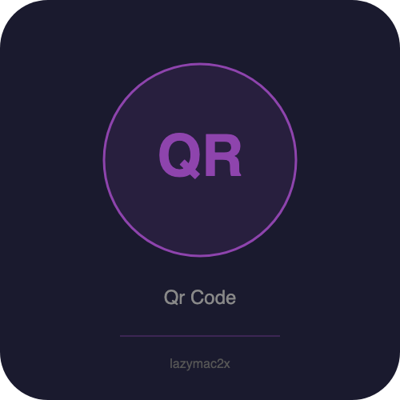

<p align="center"></p>

[](https://lazymac2x.github.io/lazymac-api-store/) [](https://coindany.gumroad.com/) [](https://mcpize.com/mcp/qr-code-api)

# QR Code API

[](https://www.npmjs.com/package/@lazymac/mcp)
[](https://smithery.ai/server/lazymac/mcp)
[](https://coindany.gumroad.com/l/zlewvz)
[](https://api.lazy-mac.com)

> 🚀 Want all 42 lazymac tools through ONE MCP install? `npx -y @lazymac/mcp` · [Pro $29/mo](https://coindany.gumroad.com/l/zlewvz) for unlimited calls.

QR code generation REST API and MCP server. Generate QR codes from text, URLs, vCards, WiFi configs, email, and phone numbers. Returns PNG, SVG, or base64. No external APIs required.

## Quick Start

```bash
npm install
npm start
# Server runs on http://localhost:3700
```

## Endpoints

| Method | Path | Description |
|--------|------|-------------|
| GET | `/api/v1/generate?data=...` | Generate QR from query params |
| GET | `/api/v1/generate/base64?data=...` | Return base64 data URL as JSON |
| POST | `/api/v1/generate` | Generate QR with full options |
| POST | `/api/v1/vcard` | Generate QR from vCard fields |
| POST | `/api/v1/wifi` | Generate QR from WiFi credentials |
| GET | `/api/v1/health` | Health check |

## Examples

### Simple text/URL QR

```bash
# PNG image (default)
curl "http://localhost:3700/api/v1/generate?data=https://example.com" -o qr.png

# SVG
curl "http://localhost:3700/api/v1/generate?data=hello&format=svg" -o qr.svg

# Custom colors and size
curl "http://localhost:3700/api/v1/generate?data=hello&size=500&darkColor=%23ff0000&lightColor=%23ffffff" -o qr.png

# Base64
curl "http://localhost:3700/api/v1/generate/base64?data=hello"
```

### vCard

```bash
curl -X POST http://localhost:3700/api/v1/vcard \
  -H "Content-Type: application/json" \
  -d '{"firstName":"John","lastName":"Doe","phone":"+1234567890","email":"john@example.com","org":"Acme"}' \
  -o vcard.png
```

### WiFi

```bash
curl -X POST http://localhost:3700/api/v1/wifi \
  -H "Content-Type: application/json" \
  -d '{"ssid":"MyNetwork","password":"secret123","encryption":"WPA"}' \
  -o wifi.png
```

### Email / Phone (via POST /generate)

```bash
# Email
curl -X POST http://localhost:3700/api/v1/generate \
  -H "Content-Type: application/json" \
  -d '{"type":"email","to":"hello@example.com","subject":"Hi","data":"_"}' \
  -o email.png

# Phone
curl -X POST http://localhost:3700/api/v1/generate \
  -H "Content-Type: application/json" \
  -d '{"type":"phone","number":"+1234567890","data":"_"}' \
  -o phone.png
```

## Query Parameters / Body Options

| Parameter | Description | Default |
|-----------|-------------|---------|
| `data` | Text/URL to encode | required |
| `format` | `png`, `svg`, `base64` | `png` |
| `size` | Image width in px (50-2000) | `300` |
| `errorCorrectionLevel` | `L`, `M`, `Q`, `H` | `M` |
| `darkColor` | Hex color for dark modules | `#000000` |
| `lightColor` | Hex color for light modules | `#ffffff` |
| `margin` | Quiet zone modules | `2` |

## MCP Server

Use as a Model Context Protocol tool server:

```bash
node src/mcp-server.js
```

### Claude Desktop config

```json
{
  "mcpServers": {
    "qr-code": {
      "command": "node",
      "args": ["/path/to/qr-code-api/src/mcp-server.js"]
    }
  }
}
```

### MCP Tools

- `generate_qr` — Text/URL to QR
- `generate_vcard_qr` — vCard contact QR
- `generate_wifi_qr` — WiFi credentials QR
- `generate_email_qr` — Email mailto QR
- `generate_phone_qr` — Phone number QR

## Docker

```bash
docker build -t qr-code-api .
docker run -p 3700:3700 qr-code-api
```

## License

MIT

## Related projects

- 🧰 **[lazymac-mcp](https://github.com/lazymac2x/lazymac-mcp)** — Single MCP server exposing 15+ lazymac APIs as tools for Claude Code, Cursor, Windsurf
- ✅ **[lazymac-api-healthcheck-action](https://github.com/lazymac2x/lazymac-api-healthcheck-action)** — Free GitHub Action to ping any URL on a cron and fail on non-2xx
- 🌐 **[api.lazy-mac.com](https://api.lazy-mac.com)** — 36+ developer APIs, REST + MCP, free tier

<sub>💡 Host your own stack? <a href="https://m.do.co/c/c8c07a9d3273">Get $200 DigitalOcean credit</a> via lazymac referral link.</sub>
